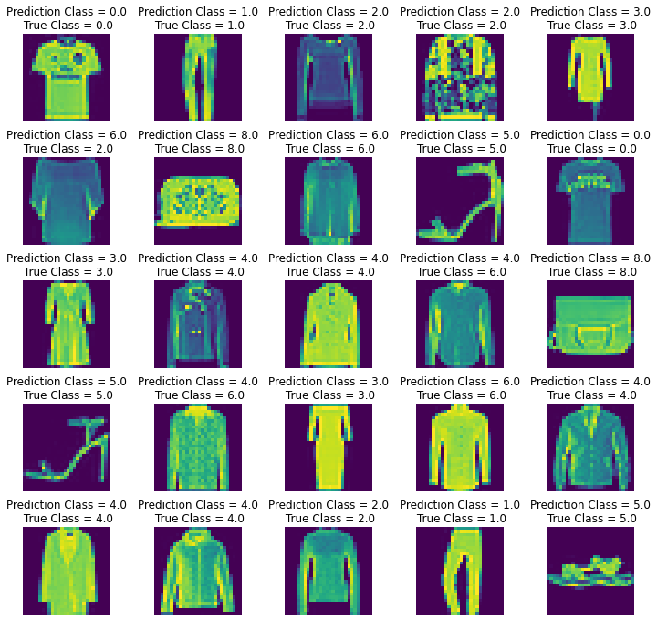
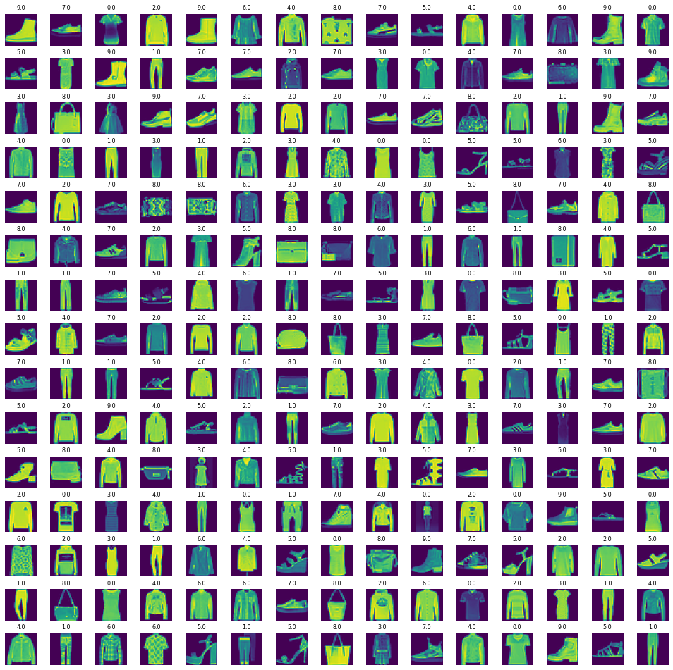

# Fashion Class Classification
Code for Fashion Class Classification Case Study 

## Problem 
Need to classify a dataset of 10,000 images, each of which is a 28x28 Grayscale Image, into one of the associated 10 Classes. For training of the model, a dataset of 60,000 images is also provided.  
Each image is 28 pixels in height and 28 pixels in width, for a total of 784 pixels in total. Each pixel has a single pixel-value associated with it, indicating the lightness or darkness of that pixel, with higher numbers meaning darker. This pixel-value is an integer between 0 and 255.

## Model Used
A Convolutional Neural Network (CNN) Model, with a total of 32 Filters / Feature Selectors, each having a size of 3x3, a Max Pooling Layer of size 2x2, the Flatten Layer, and  a Dense Layer with 64 Neurons, and the final Dense (Output) Layer, classifying the Input into 1 of the 10 Associated Classes.

## Evaluation Results
*The following plot (Matplotlib Subplots) shows 25 samples with the True Class & Predicted Class of each, from the Test Set, consisting of around 10,000 Images*
 
 

## Visualisation of the data
*The following plot (Matplotlib Subplots) shows 225 Random Images from the Training Dataset, consisting of around 60,000 Images*
 
 

